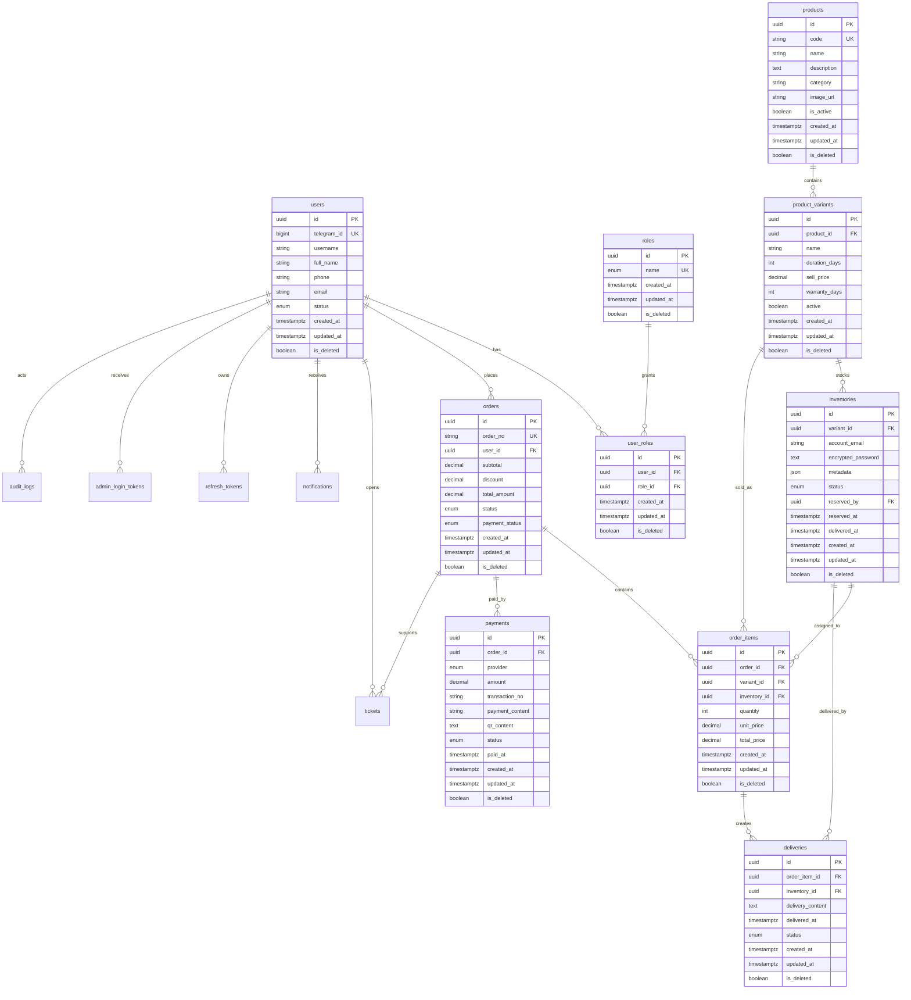

# AI Store Phase 1 - ERD

```mermaid
erDiagram
  users ||--o{ user_roles : has
  roles ||--o{ user_roles : grants
  users ||--o{ orders : places
  users ||--o{ tickets : opens
  users ||--o{ notifications : receives
  users ||--o{ refresh_tokens : owns
  users ||--o{ admin_login_tokens : receives
  users ||--o{ audit_logs : acts

  products ||--o{ product_variants : contains
  product_variants ||--o{ inventories : stocks
  product_variants ||--o{ order_items : sold_as

  orders ||--o{ order_items : contains
  orders ||--o{ payments : paid_by
  orders ||--o{ tickets : supports

  inventories ||--o{ order_items : assigned_to
  inventories ||--o{ deliveries : delivered_by
  order_items ||--o{ deliveries : creates

  users {
    uuid id PK
    bigint telegram_id UK
    string username
    string full_name
    string phone
    string email
    enum status
    timestamptz created_at
    timestamptz updated_at
    boolean is_deleted
  }

  roles {
    uuid id PK
    enum name UK
    timestamptz created_at
    timestamptz updated_at
    boolean is_deleted
  }

  user_roles {
    uuid id PK
    uuid user_id FK
    uuid role_id FK
    timestamptz created_at
    timestamptz updated_at
    boolean is_deleted
  }

  products {
    uuid id PK
    string code UK
    string name
    text description
    string category
    string image_url
    boolean is_active
    timestamptz created_at
    timestamptz updated_at
    boolean is_deleted
  }

  product_variants {
    uuid id PK
    uuid product_id FK
    string name
    int duration_days
    decimal sell_price
    int warranty_days
    boolean active
    timestamptz created_at
    timestamptz updated_at
    boolean is_deleted
  }

  inventories {
    uuid id PK
    uuid variant_id FK
    string account_email
    text encrypted_password
    json metadata
    enum status
    uuid reserved_by FK
    timestamptz reserved_at
    timestamptz delivered_at
    timestamptz created_at
    timestamptz updated_at
    boolean is_deleted
  }

  orders {
    uuid id PK
    string order_no UK
    uuid user_id FK
    decimal subtotal
    decimal discount
    decimal total_amount
    enum status
    enum payment_status
    timestamptz created_at
    timestamptz updated_at
    boolean is_deleted
  }

  order_items {
    uuid id PK
    uuid order_id FK
    uuid variant_id FK
    uuid inventory_id FK
    int quantity
    decimal unit_price
    decimal total_price
    timestamptz created_at
    timestamptz updated_at
    boolean is_deleted
  }

  payments {
    uuid id PK
    uuid order_id FK
    enum provider
    decimal amount
    string transaction_no
    string payment_content
    text qr_content
    enum status
    timestamptz paid_at
    timestamptz created_at
    timestamptz updated_at
    boolean is_deleted
  }

  deliveries {
    uuid id PK
    uuid order_item_id FK
    uuid inventory_id FK
    text delivery_content
    timestamptz delivered_at
    enum status
    timestamptz created_at
    timestamptz updated_at
    boolean is_deleted
  }
```

