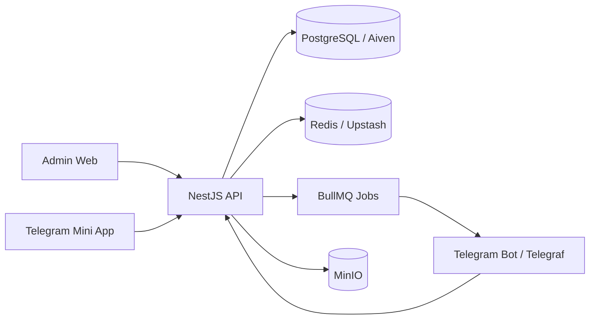

# AI Store Phase 1 - System Architecture

## Scope

Phase 1 establishes the target production architecture, folder structure, ERD, Prisma schema, and database design for AI Store.

## Target Domains

| App | Responsibility | Local URL |
| --- | --- | --- |
| frontend-admin | Admin dashboard and back-office operations | http://localhost:2110 |
| frontend-miniapp | Telegram Mini App customer storefront | http://localhost:0405 |
| backend | API, business logic, Telegram bot, jobs | http://localhost:8903 |

## Architecture



## Backend Clean Architecture

Each domain module follows:

```text
module/
  controllers/
  services/
  repositories/
  dto/
  entities/
  interfaces/
  guards/
  decorators/
  strategies/
  mappers/
  validators/
```

Initial domain modules:

- auth
- users
- roles
- telegram
- products
- inventories
- orders
- payments
- deliveries
- notifications
- tickets
- audit-logs
- common
- configs
- prisma
- jobs

## Frontend Feature Architecture

Frontend code is feature-based:

```text
features/
  auth/
  dashboard/
  products/
  orders/
  cart/
  profile/
components/
hooks/
lib/
providers/
services/
store/
app/
```

## Security Baseline

- Customer login uses Telegram Mini App initData only.
- Admin login uses Telegram Bot one-time login token.
- Password login, email login, and OTP login are not part of the customer auth flow.
- JWT access tokens are issued only after Telegram initData or admin one-time token verification.
- Refresh tokens and admin login tokens are stored hashed.
- Every admin mutation should create an audit log.

